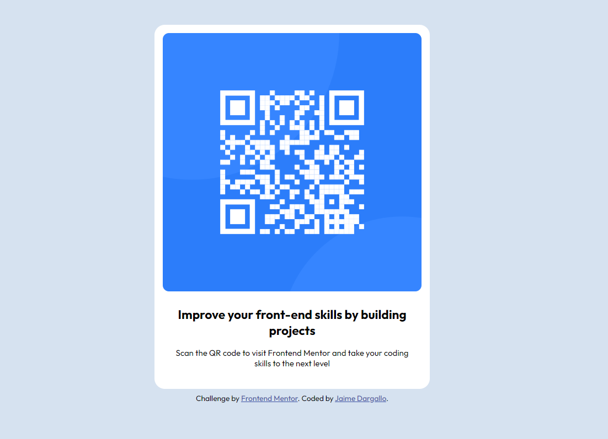

# Frontend Mentor - QR code component solution

This is a solution to the [QR code component challenge on Frontend Mentor](https://www.frontendmentor.io/challenges/qr-code-component-iux_sIO_H). Frontend Mentor challenges help you improve your coding skills by building realistic projects.

## Table of contents

- [Overview](#overview)
  - [Screenshot](#screenshot)
  - [Links](#links)
- [My process](#my-process)
  - [Built with](#built-with)
  - [What I learned](#what-i-learned)
  - [Useful resources](#useful-resources)
- [Author](#author)
- [Acknowledgments](#acknowledgments)

## Overview

### Screenshot



### Links

- Solution URL: [@jaimedargallo/QR-code-component-main](https://github.com/jaimedargallo/QR-code-component-main)
- Live Site URL: [https://frontendmentor-qr-code-dusky.vercel.app](https://frontendmentor-qr-code-dusky.vercel.app)

## My process

### Built with

- Semantic HTML5 markup
- Flexbox
- Mobile-first workflow

### What I learned

In this proyect I learn about:

Using semantic HTML5 markup would have taught the importance of creating structured and meaningful content that search engines and screen readers can easily interpret.

How to create flexible layouts that can adapt to different screen sizes and devices. I would have also learned how to control the alignment and distribution of content within the layout.

Adopting a mobile-first workflow would have taught I how to prioritize mobile devices when designing your project. This approach would have helped I create a responsive design that looks great on both small and large screens.
The importance of using media queries to adjust the layout based on the device's screen size.

To see how you can add code snippets, see below:

```html
<main>
  <article class="card">
    
    <h2>Improve your front-end skills by building projects</h2>
    ...
  </article>
</main>
```

```css
body {
  align-items: center;
  background-color: hsl(212, 45%, 89%);
  display: flex;
  flex-direction: column;
  font-family: 'Outfit', sans-serif;
  justify-content: center;
}
```

### Useful resources

- [Freecodecamp](https://www.freecodecamp.org/) - The place where I learn the basics about HTML and CSS.
- [Flexbox Froggy](https://flexboxfroggy.com/) - A game to practice flexbox with CSS.
- [Flexbox Defense](http://www.flexboxdefense.com/)

## Author

- Frontend Mentor - [@jaimedargallo](https://www.frontendmentor.io/profile/jaimedargallo)
- Twitter - [@jaimedargallo](https://twitter.com/jaimedargallo)
- Github - [@jaimedargallo](https://github.com/jaimedargallo)

## Acknowledgments

I would like to take this opportunity to express my heartfelt gratitude and appreciation to my personal mentor [@boton](https://github.com/boton). I feel incredibly fortunate to have had the privilege of working closely with such an inspiring and supportive mentor.
